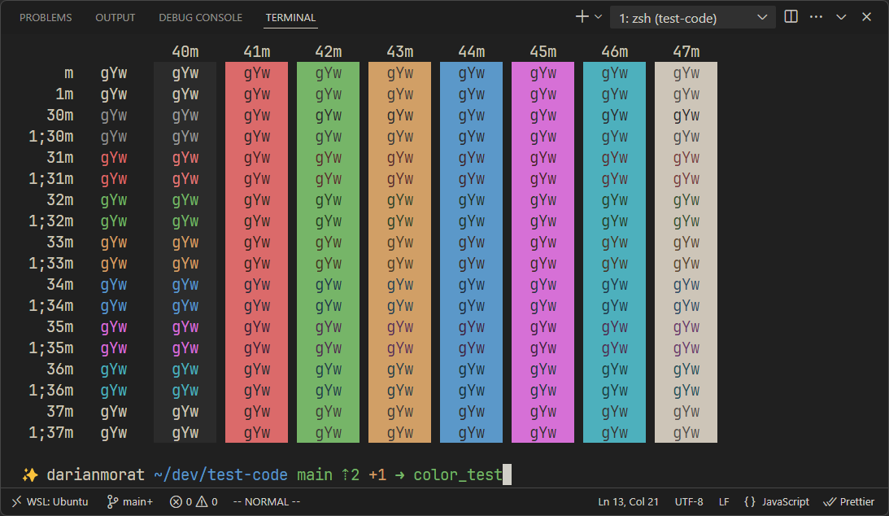
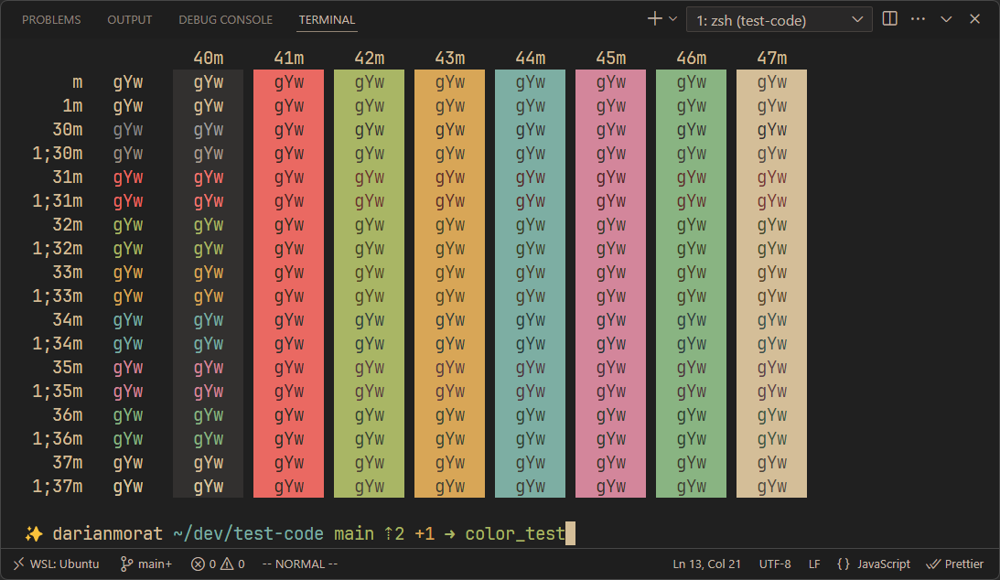
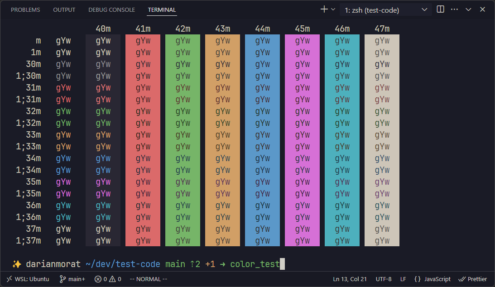
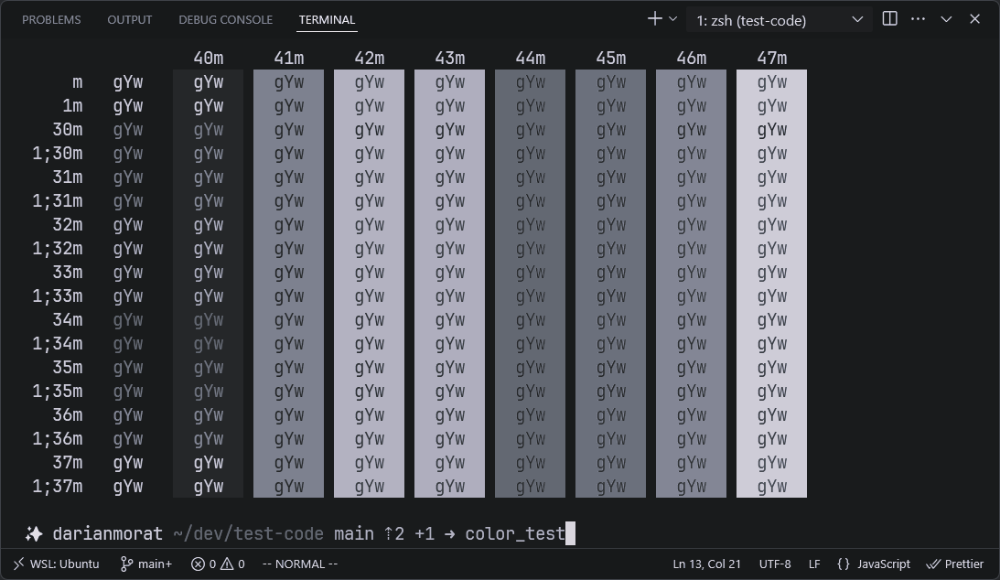
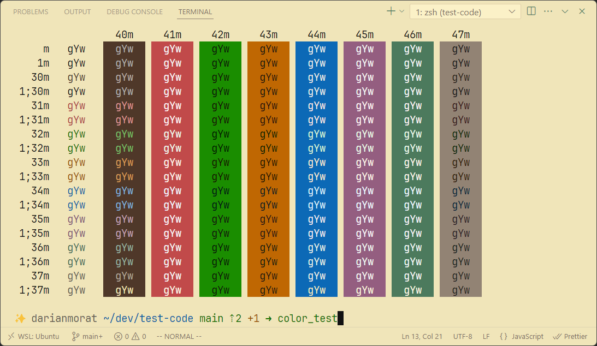
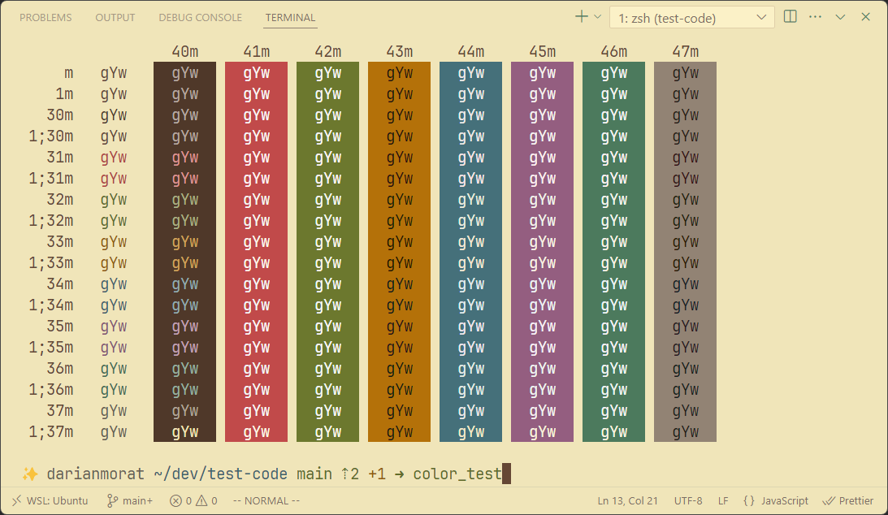

<!-- Table 1 -->
<table width="100%">
  <tr>
    <th width="50%">GruvDark</th>
    <th width="50%">Gruvdark-GBM</th>
  </tr>
  <tr>
    <td> </td>
    <td> </td>
  </tr>
</table>

<!-- Table 2 -->
<table width="100%">
  <tr>
    <th width="50%">Gruvdark-Tokyo</th>
    <th width="50%">Soon...</th>
  </tr>
  <tr>
    <td> </td>
    <td> </td>
  </tr>
</table>

<!-- Table 3 -->
<table width="100%">
  <tr>
    <th width="50%">Light GruvDark</th>
    <th width="50%">Light GruvDark-GBM</th>
  </tr>
  <tr>
    <td> </td>
    <td> </td>
  </tr>
</table>

### Inspirations

-  [Gruvbox Material](https://github.com/sainnhe/gruvbox-material-vscode) - Rich, warm tones with a well-balanced contrast.
-  [OneDarkPro](https://github.com/Binaryify/OneDark-Pro) - Bold, high-contrast palette with modern flair.
-  [VSCode Default](https://github.com/microsoft/vscode) - Subtle background accents and clean borders.

---

GruvDark created by <a href="https://github.com/darianmorat">Darian Toledo.</a> ✨  
Have a good one!
