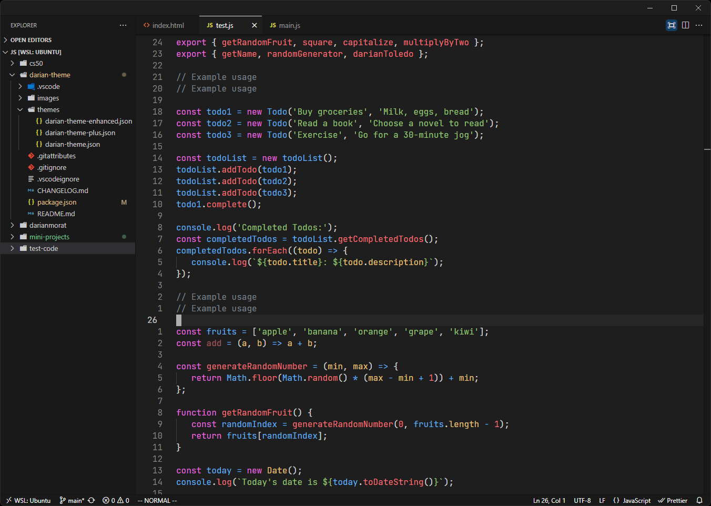
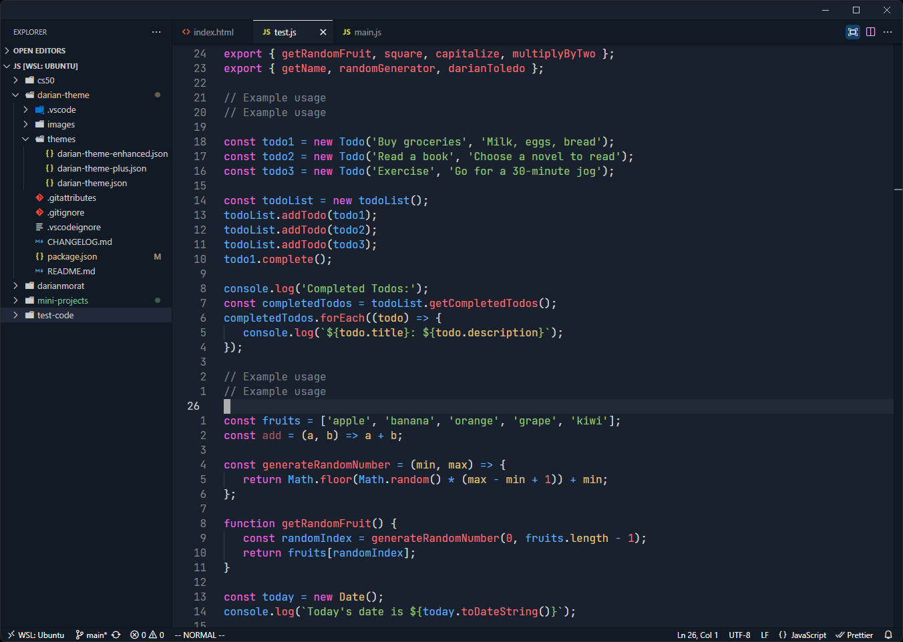
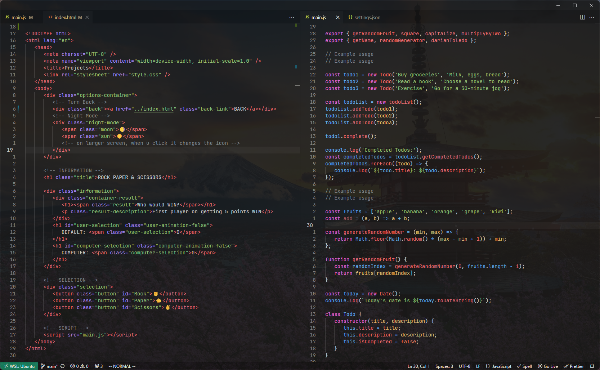
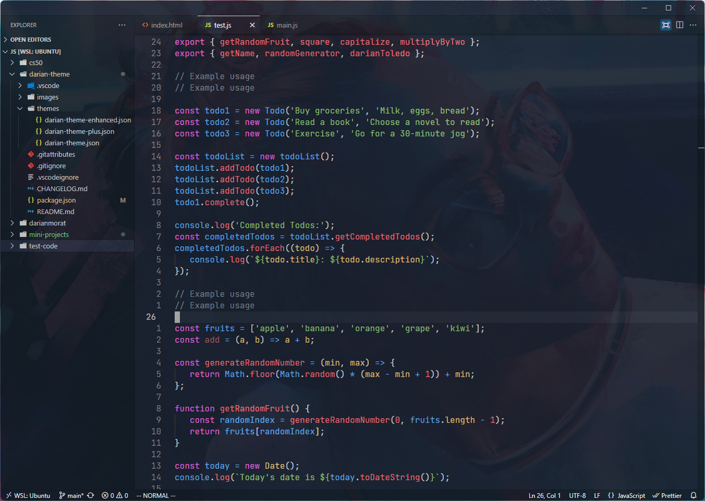

<!-- Cover image like github readme profile  -->

## Screenshots

### Darian Theme


&nbsp;

### Darian Theme Plus


&nbsp;

## Getting started

You can install this theme through the [Visual Studio Marketplace](https://marketplace.visualstudio.com/items?itemName=darianmorat.darian-theme)

1. Open **Extensions** sidebar panel in VS Code. `View → Extensions`
2. Search for `Darian Theme`
3. Click **Install**
4. Click **Reload** to reload your editor
5. _File > Preferences > Settings > Workbench > Color Theme >_ **Darian Theme**
6. Optional: Use the recommended settings below for best experience

&nbsp;

## Settings for VIM / Minimalist users

For those who want a Visual Studio Code more simplistic without all the extra information like you can notice on the <a href="#screenshots">screenshots</a> section, you can add this to your settings.json:

```json
   "window.menuBarVisibility": "toggle",
   "workbench.activityBar.location": "hidden",
   "editor.minimap.enabled": false,
   "window.commandCenter": false,
   "workbench.layoutControl.enabled": false,
   "breadcrumbs.enabled": false,
   "window.title": " ",
```

Also if you wanna remove the extra decoration color of the brackets you can add this on your settings.json:

```json
   "editor.bracketPairColorization.enabled": false,
   "editor.bracketPairColorization.independentColorPoolPerBracketType": false,
```

## EXTRA

If you wanna go a bit further (like me), you can also add transparency to your theme, and is gonna give you the VIM customization feeling

1. Open **Extensions** sidebar panel in VS Code. `View → Extensions`
2. Search for `Glasslt-VSC`
3. Click **Install**
4. Modify to preference

### Darian Theme - Modified


&nbsp;

### Darian Theme Plus - Modified


&nbsp;
---

Theme created by <a href="https://github.com/darianmorat">Darian Toledo</a> ✨ <br />
Enjoy it
