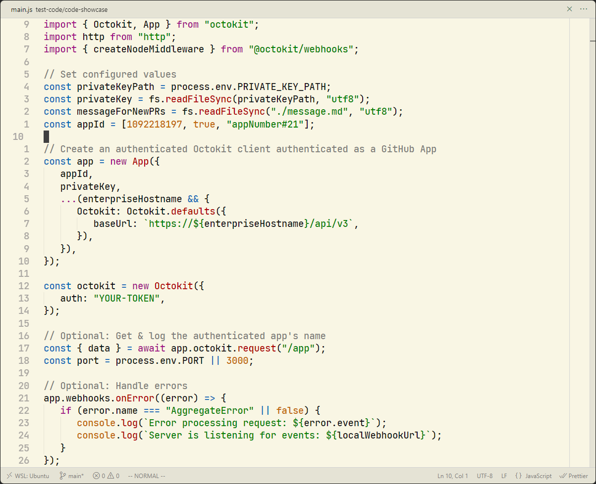

### Notes
- Font used: [Jetbrains Mono](https://www.jetbrains.com/lp/mono).
- For light themes use `Font weight: 600`.

### Showcase

| GruvDark | Light Gruvdark |
| -------- | -------------- |
|  |  |

| GruvDark-GBM | Light Gruvdark-GBM |
| ------------ | ------------------ |
|  |  |

| GruvDark-Mono | Light Gruvdark-Mono |
| ------------- | ------------------- |
|  |  |

| GruvDark-Tokyo | Light Gruvdark-Tokyo |
| -------------- |--------------------- |
|  |  |

### Inspirations

-  [Gruvbox Material](https://github.com/sainnhe/gruvbox-material-vscode) - Warm tones with a well-balanced contrast.
-  [OneDarkPro](https://github.com/Binaryify/OneDark-Pro) - Vivid and strong color  palette with modern flair.
-  [VSCode Default](https://github.com/microsoft/vscode) - Subtle background accents and clean borders.
-  [Monochrome](https://marketplace.visualstudio.com/items?itemName=anotherglitchinthematrix.monochrome) - Simple and minimalistic black and white colors.

---

GruvDark created by <a href="https://github.com/darianmorat">Darian Toledo</a>. ✨  
Have a good one!
