|                                 GruvDark                                  | Gruvdark-GBM                                                                          |
| :-----------------------------------------------------------------------: | ------------------------------------------------------------------------------------- |
| 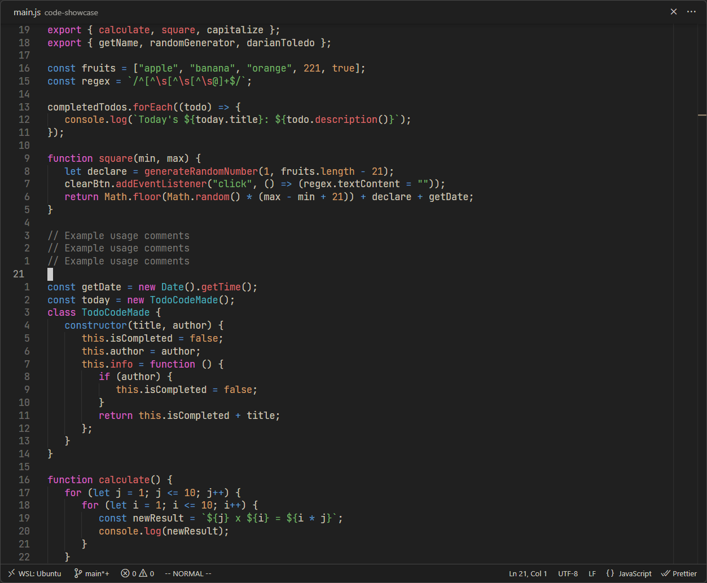 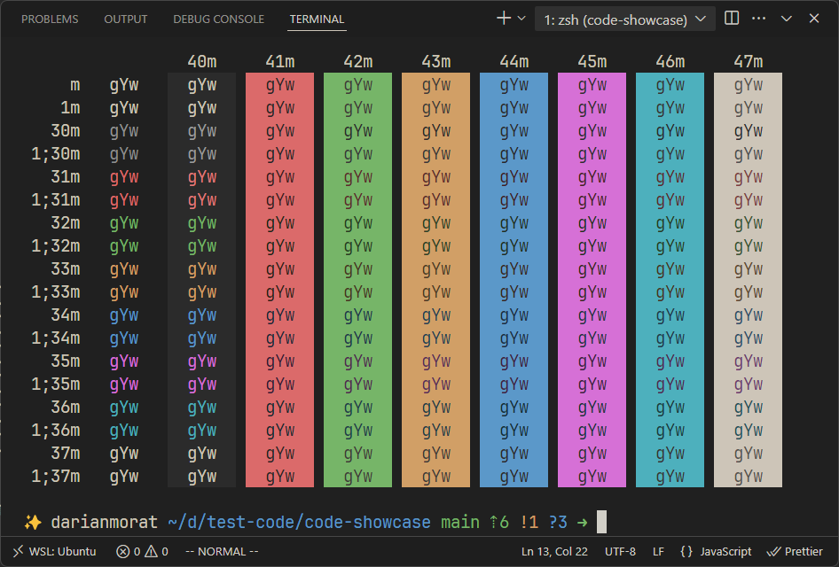 | 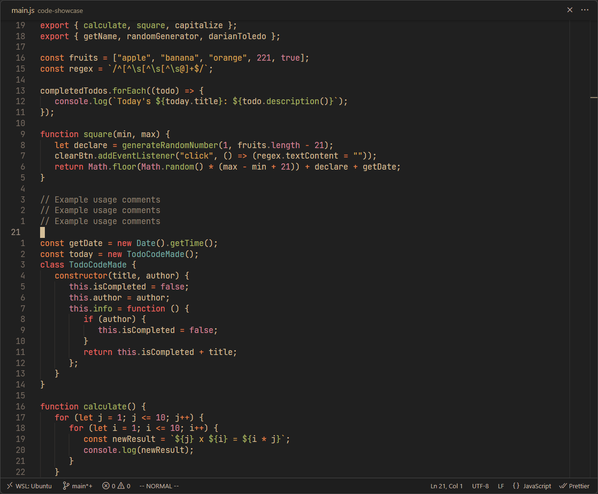 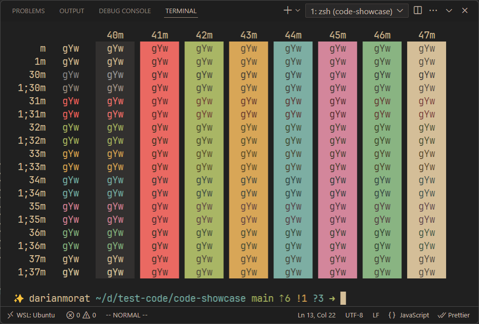 |

|                                       Gruvdark-Tokyo                                        |                                         Soon...                                          |
| :-----------------------------------------------------------------------------------------: | :--------------------------------------------------------------------------------------: |
| 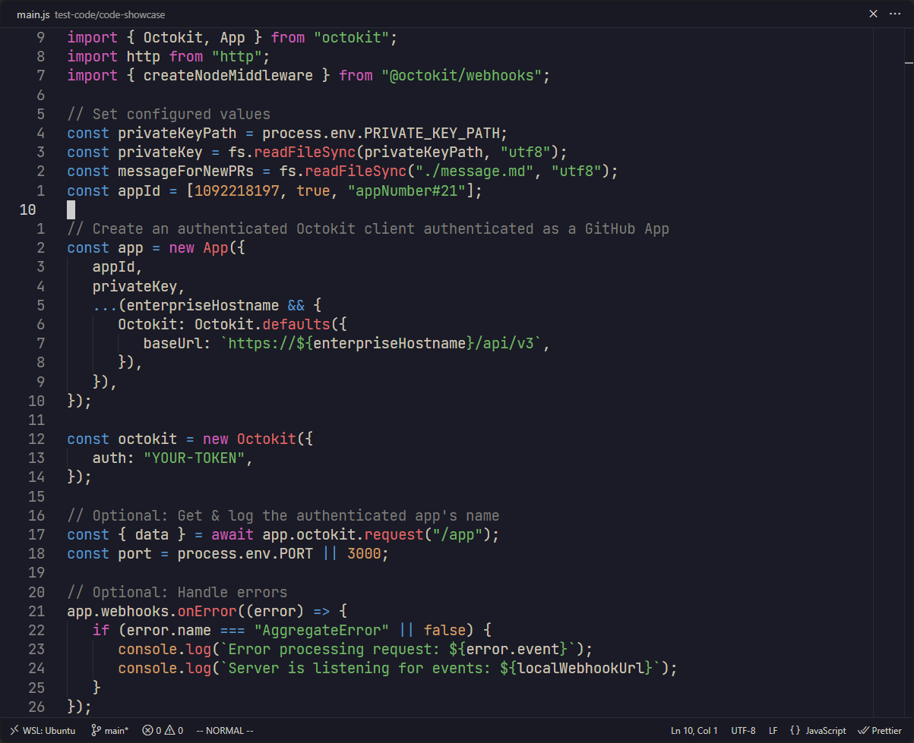 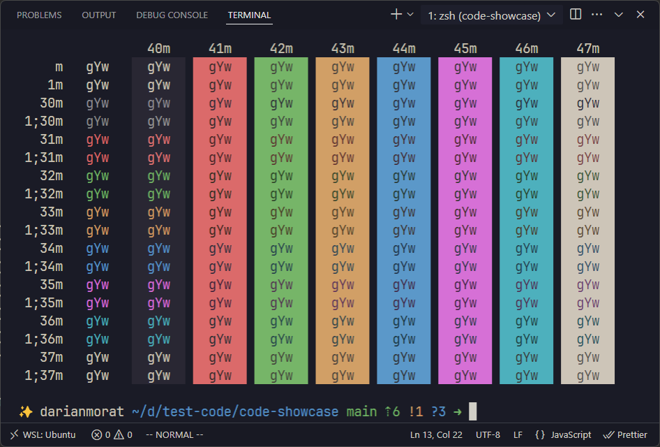 | 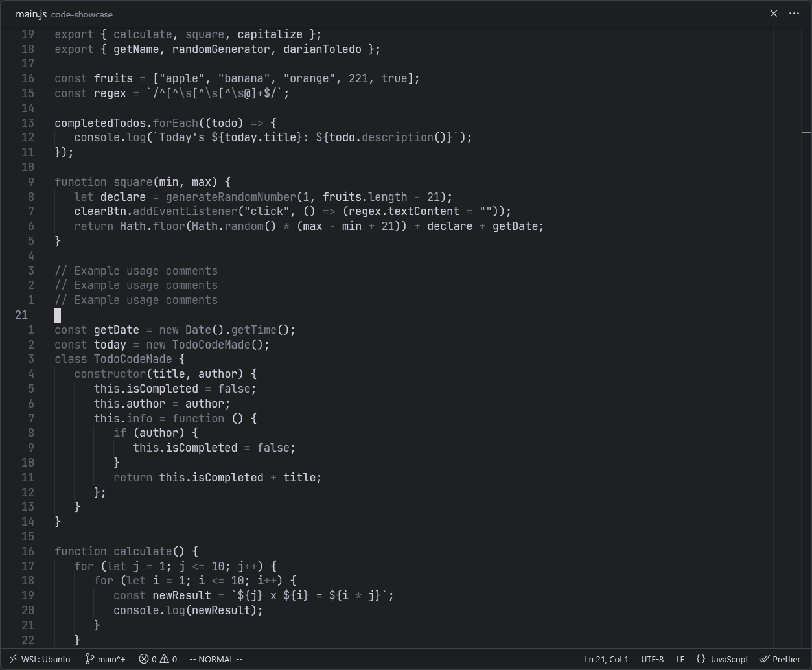 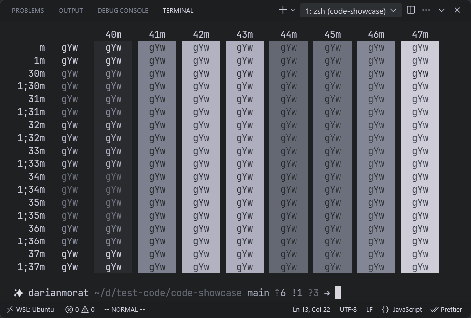 |

|                                       Light GruvDark                                        | Light GruvDark-GBM                                                                                      |
| :-----------------------------------------------------------------------------------------: | ------------------------------------------------------------------------------------------------------- |
| 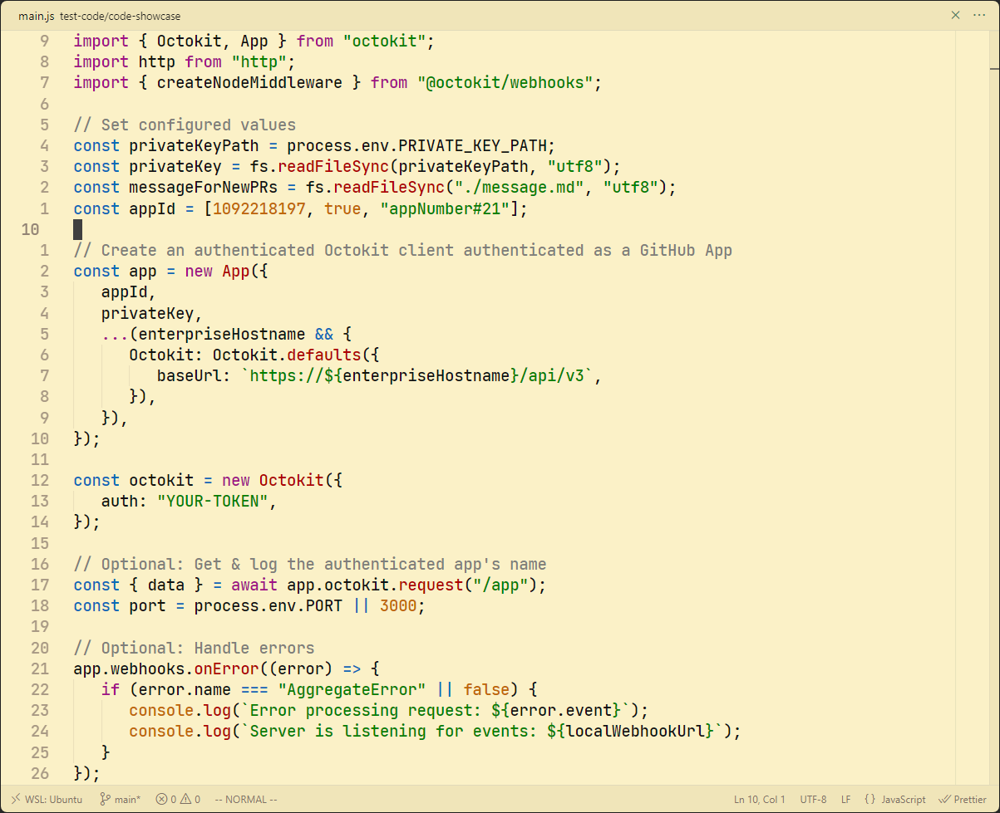 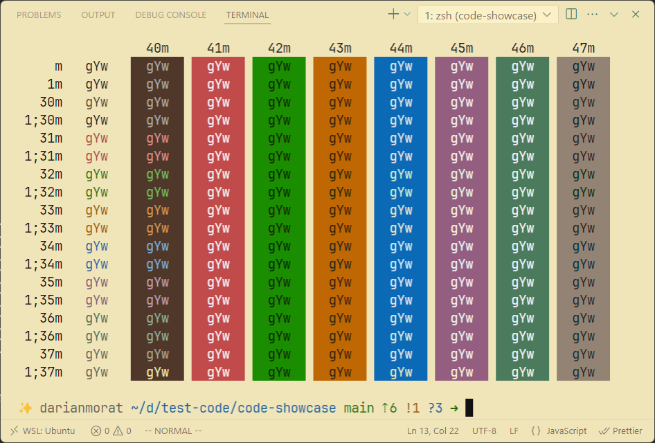 | 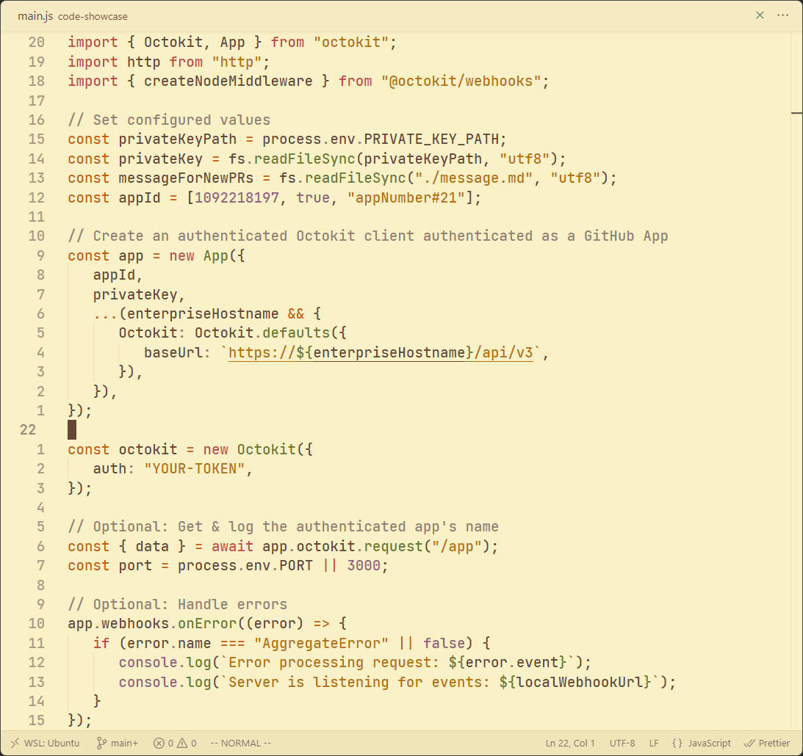 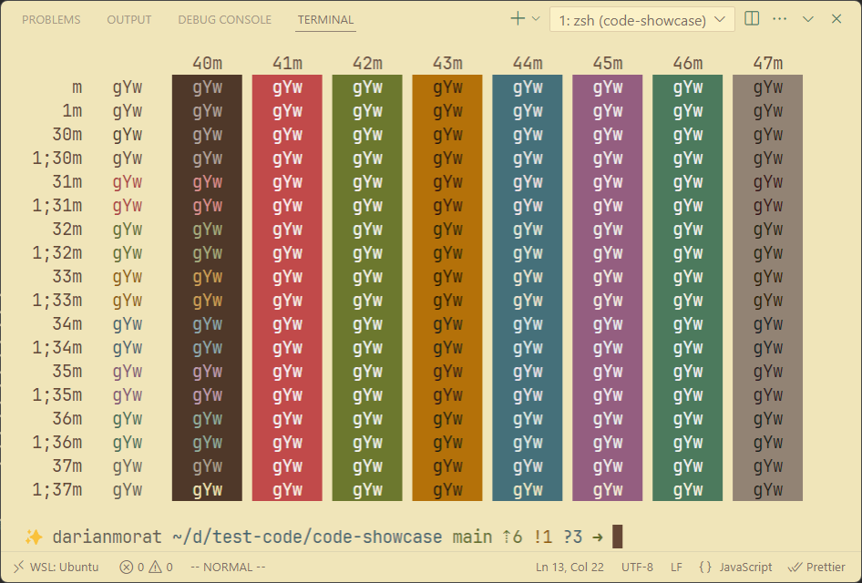 |

### Inspirations

-  [Gruvbox Material](https://github.com/sainnhe/gruvbox-material-vscode) - Rich, warm tones with a well-balanced contrast.
-  [OneDarkPro](https://github.com/Binaryify/OneDark-Pro) - Bold, high-contrast palette with modern flair.
-  [VSCode Default](https://github.com/microsoft/vscode) - Subtle background accents and clean borders.

---

GruvDark created by <a href="https://github.com/darianmorat">Darian Toledo.</a> ✨  
Have a good one!
