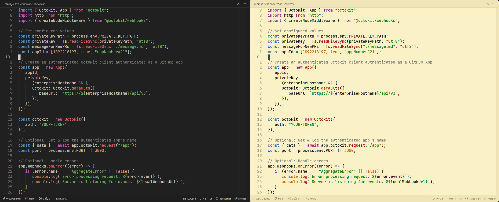
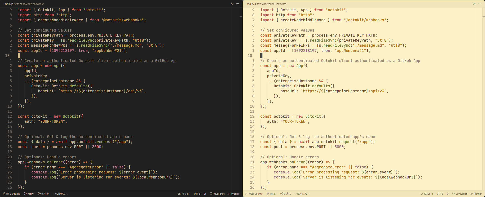
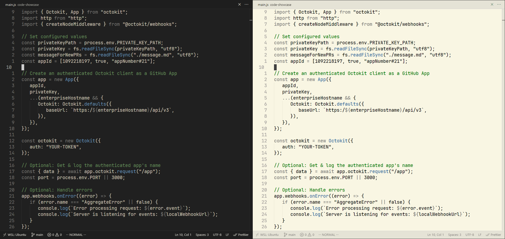
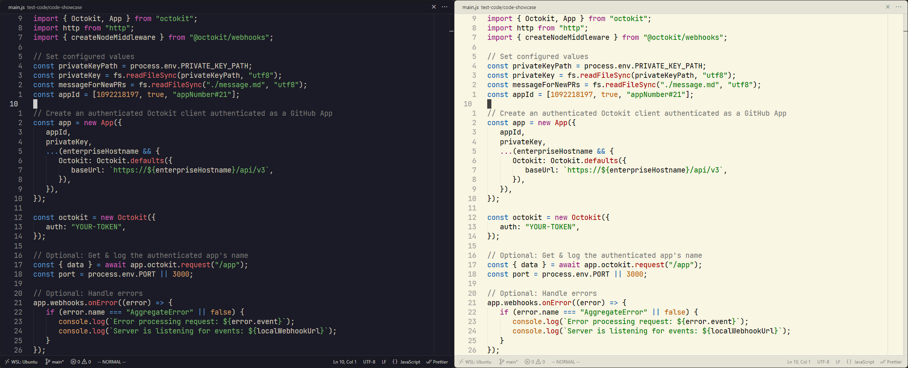

### Notes:
- Font used: [JetBrains Mono NL Slashed](https://github.com/sharpjs/JetBrainsMonoSlashed).
- For light themes `Font weight: 600`.

##

<strong>GruvDark</strong>

##

 

<strong>GruvDark-GBM</strong>

##

 

<strong>GruvDark-Mono</strong>

##

 

<strong>GruvDark-Tokyo</strong>

## 

Theme created by <a href="https://github.com/darianmorat">Darian Toledo</a>.
 
Have a good one!
