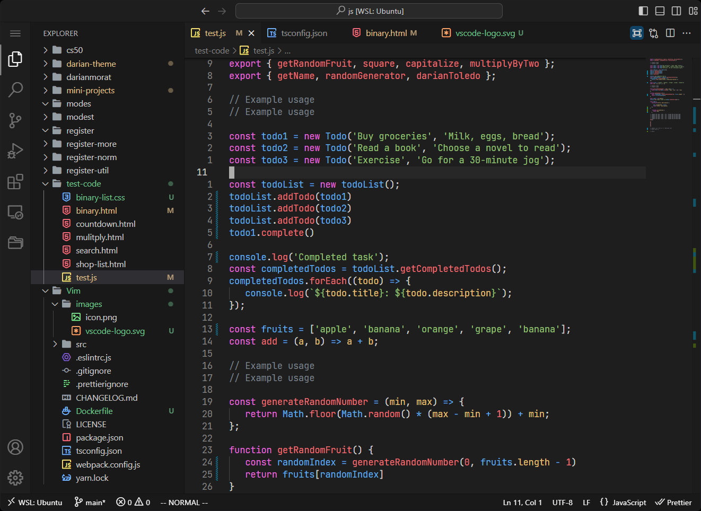
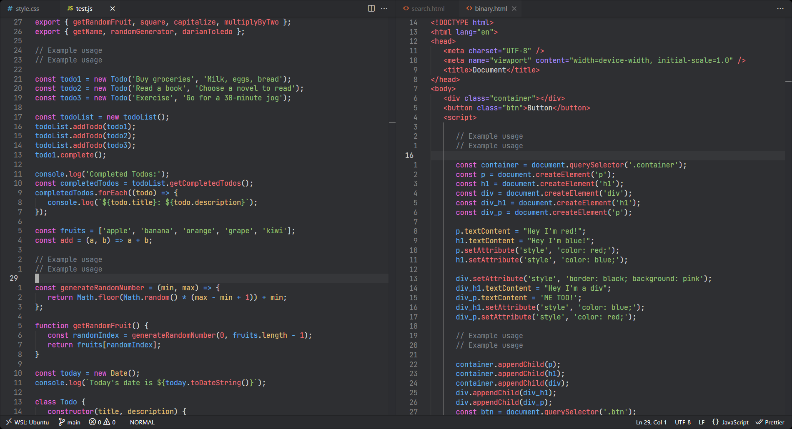
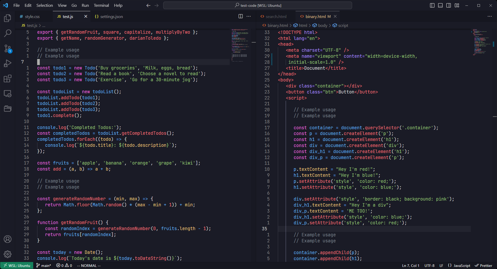
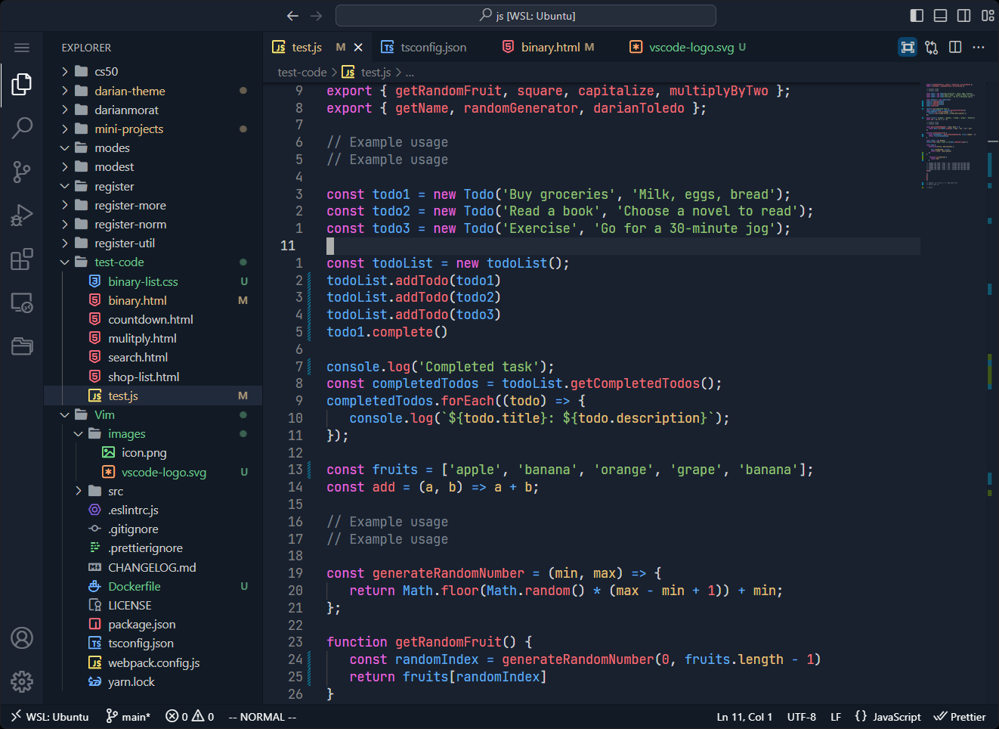
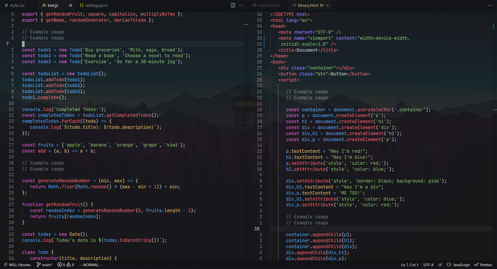

> **Note:**
> Main focus on HTML, CSS & JAVASCRIPT, later on it would support more languages.

### DTheme


&nbsp;

### DTheme Dimmed


&nbsp;

### DTheme Tokyo


&nbsp;

### DTheme Deep


&nbsp;

### DTheme Modified



You can customize your **vscode** with [Apc Customize UI++](https://marketplace.visualstudio.com/items?itemName=drcika.apc-extension) and a few aditional settings on your `settings.json`.

```json
   "window.titleBarStyle": "native",
   "apc.electron": { "frame": false },

   "window.commandCenter": false,
   "workbench.layoutControl.enabled": false,
   "editor.minimap.enabled": false,
   "breadcrumbs.enabled": false,
   "workbench.activityBar.location": "hidden",
```

### Inspirations

-  [OneDarkPro](https://github.com/Binaryify/OneDark-Pro) - Vivid syntax colors.
-  [VSCode Default]() - Background & Details to borders.
-  [Github Theme](https://github.com/primer/github-vscode-theme) - Dimmed and highlighting.

---

Theme created by <a href="https://github.com/darianmorat">Darian Toledo.</a> ✨ <br />
Have a good one!
