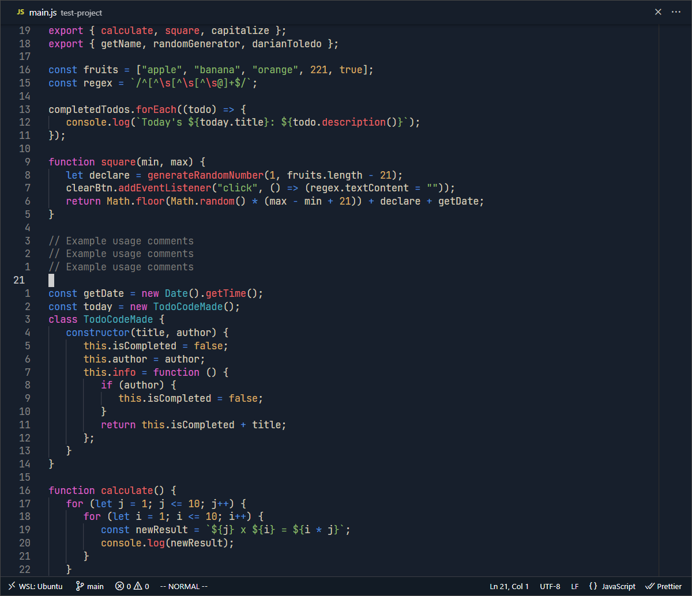

> **Note:**
> Main focus on HTML, CSS & JAVASCRIPT, later on it would support more languages.

### DTheme

&nbsp;

### DTheme Dimmed

&nbsp;

### DTheme Tokyo

&nbsp;

### DTheme Deep

&nbsp;

### Inspirations

-  [OneDarkPro](https://github.com/Binaryify/OneDark-Pro) - Color palette.
-  [Gruvbox](https://github.com/sainnhe/gruvbox-material-vscode) - Warm colors and logic.
-  [VSCode Default]() - Background & Detail to borders.

---

Theme created by <a href="https://github.com/darianmorat">Darian Toledo.</a> ✨  
Have a good one!
