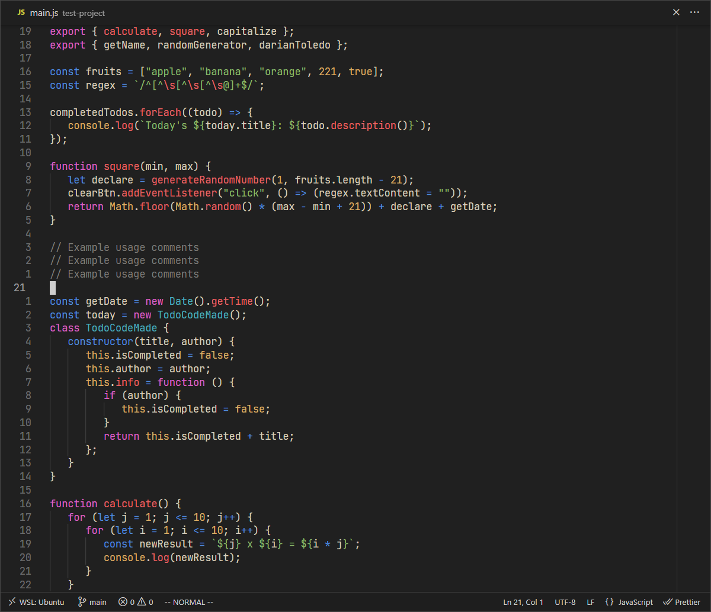
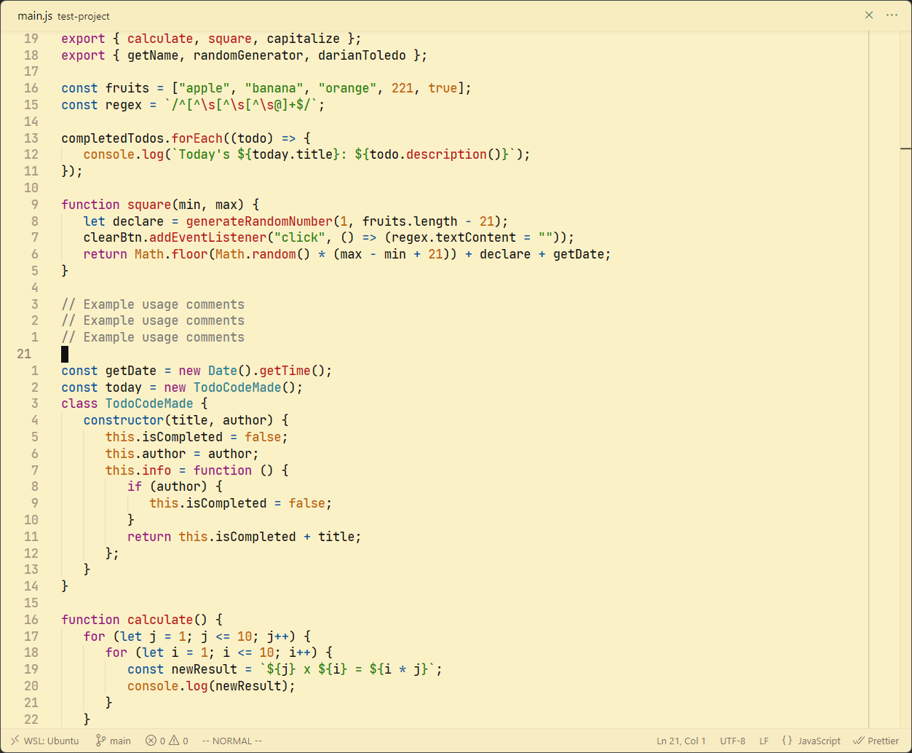
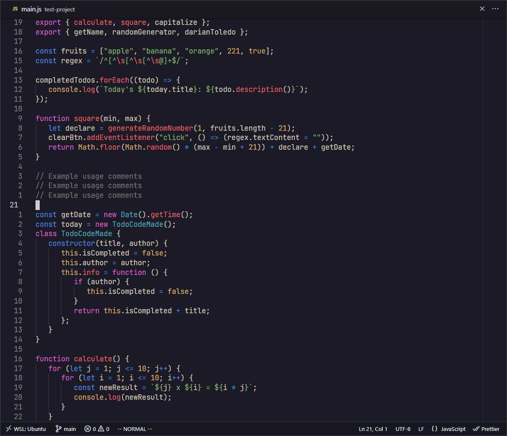

### Pending:

**Support:** Right now the main focus is on html, css & javascript.<br>

### DTheme


&nbsp;

### DTheme Light


&nbsp;

### DTheme Tokyo


&nbsp;

### Color Palette

<!-- Visual color palette like https://github.com/morhetz/gruvbox/tree/master -->

**Dark theme:**

```
 blue: #5b98c9
 aqua: #4db0bd
 red: #db6a6a
 pink: #db63c5
 yellow: #d19f66
 green: #76b568
 white: #cdc5b8
 purple: #9266da
```

**Light theme:**

```
// blue: #00579f
// aqua: #228592
// red: #c01414
// pink: #a10f86
// yellow: #bf6702
// green: #1a8702
// black: #111111
// purple: #480aab
```

### Inspirations

-  [OneDarkPro](https://github.com/Binaryify/OneDark-Pro) - Color palette high contrast.
-  [Gruvbox](https://github.com/sainnhe/gruvbox-material-vscode) - Warm colors and logic.
-  [VSCode Default]() - Background and borders.

&nbsp;

---

Theme created by <a href="https://github.com/darianmorat">Darian Toledo.</a> ✨ <br />
Have a good one!
