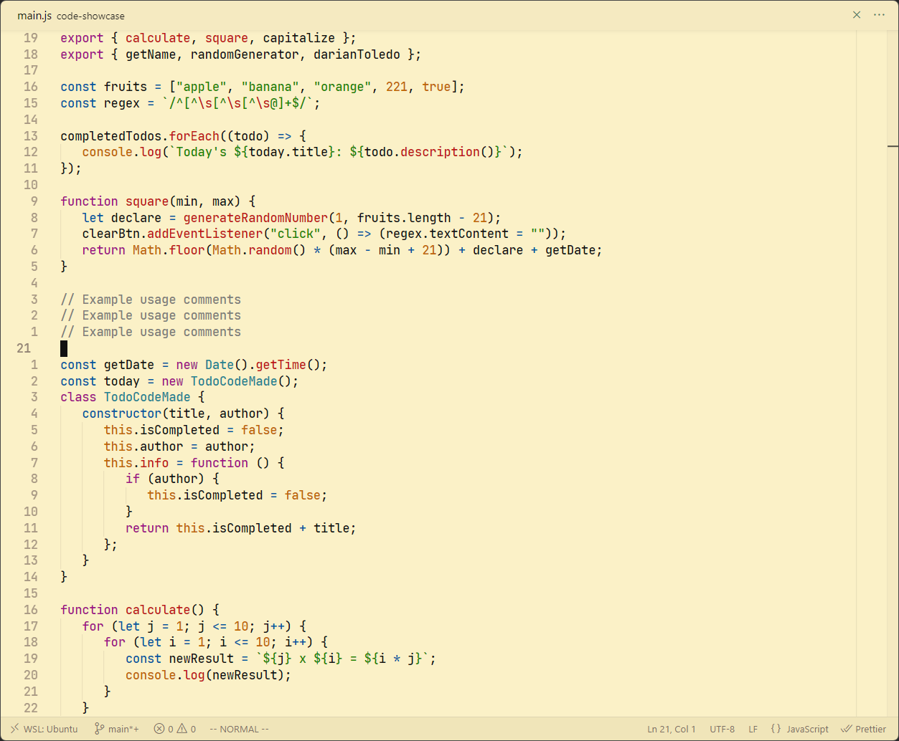

### Pending:

**Support +languages for GruvDark Themes:** Right now the main focus is on html, css & javascript. Contributions are more than welcome!<br>

### GruvDark


&nbsp;

### GruvDark Light


&nbsp;

### GruvDark-Tokyo


&nbsp;

> GruvDark-GBM theme is based on Gruvbox-Material (with a few personal changes) by Sainnhe Park

### GruvDark-GBM


&nbsp;

### GruvDark-GBM Light


&nbsp;

### Color Palette

<!-- Visual color palette like https://github.com/morhetz/gruvbox/tree/master -->

**GruvDark GBM:**

[Here](https://github.com/sainnhe/gruvbox-material-vscode) you can find the color palette that is used for GruvDark GBM from Gruvbox Material... The ones in this pack theme are **Dark:Material palette** & **Light:Original palette**.

<br />

**GruvDark:**

```
 blue: #5b98c9
 aqua: #4db0bd
 red: #db6a6a
 pink: #db63c5
 yellow: #d19f66
 green: #76b568
 white: #cdc5b8
 purple: #9266da
```

**GruvDark Light:**

```
blue: #00579f
aqua: #228592
red: #c01414
pink: #a10f86
yellow: #bf6702
green: #1a8702
black: #111111
purple: #480aab
```

### Inspirations

-  [OneDarkPro](https://github.com/Binaryify/OneDark-Pro) - Color palette high contrast.
-  [Gruvbox Material](https://github.com/sainnhe/gruvbox-material-vscode) - Warm colors and logic.
-  [VSCode Default]() - Background touch and borders.

&nbsp;

---

GruvDark created by <a href="https://github.com/darianmorat">Darian Toledo.</a> ✨ <br />
Have a good one!
